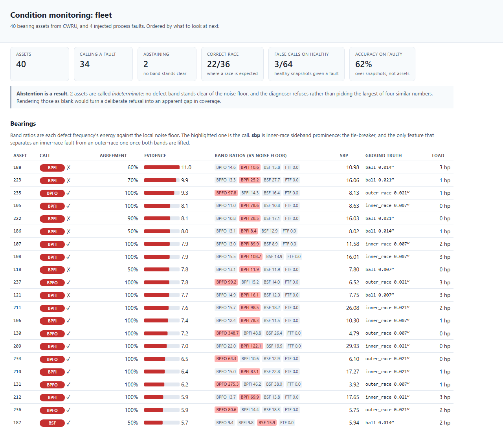
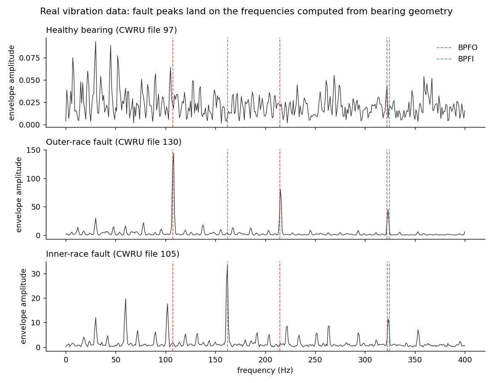

# Condition Monitoring: Sensor Anomaly Detection & Health Indexing

## What it is

A system that watches machines through their sensors and answers three questions:

1. **Is something wrong?** A 0-100 health score per machine, with an alarm.
2. **What is wrong?** For bearings, it names the damaged part: outer race, inner
   race, or ball.
3. **Which machine should I look at first?** A fleet dashboard, sorted by urgency,
   with the evidence behind every call.

It covers two kinds of equipment:

- **Rotating machines (bearings)**, using vibration signals.
- **Process plants** (many sensors on one process), using the relationships
  between sensors.



*The fleet dashboard (`python run_dashboard.py`): 40 real bearings, most urgent
first. Each row shows the call, how often the snapshots agreed, and the evidence
behind it.*

## Skills and keywords

**Machine learning:** anomaly detection, condition monitoring, predictive maintenance, fault diagnosis, health index, Isolation Forest, autoencoder (PyTorch), Hotelling T² / Mahalanobis distance, PCA (T² and SPE), dynamic PCA, multivariate statistical process control (MSPC), explainable AI (per-feature contributions), false-alarm rate tuning, alarm management, time-series analysis

**Signal processing:** vibration analysis, envelope analysis, Hilbert transform, FFT, band-pass filtering, spectral kurtosis / kurtogram, bearing fault frequencies (BPFO, BPFI, BSF, FTF), sidebands, order tracking, SciPy

**Engineering:** fleet monitoring dashboard, HTTP API, SQLite, alarm acknowledgement workflow, CI/CD (GitHub Actions), pytest (126 tests)

**Data:** CWRU bearing dataset, Tennessee Eastman process (TEP), SKAB, industrial sensor data, IIoT, Python, NumPy, scikit-learn, matplotlib

## What we did

1. **Built physics-based features.** Each bearing fault makes a vibration at a
   frequency set by the bearing's geometry. We compute those frequencies and look
   for energy there, using envelope analysis rather than learning features from data.
2. **Built a health score and an alarm** that doesn't flip on and off (it uses
   separate on/off levels and needs 3 bad readings out of 5).
3. **Compared three detectors fairly:** a statistical one (Hotelling T²), an
   Isolation Forest, and a deep autoencoder, all held to the same false-alarm budget.
4. **Tested on real data.** 40 real vibration recordings from the CWRU bearing lab
   for diagnosis, and Tennessee Eastman (a standard 52-sensor chemical plant
   benchmark) plus SKAB (a real water rig) for the process side.
5. **Built the dashboard as a service,** with history per machine and alarm
   acknowledgements that switch back on if things get worse.
6. **Handled machines that change speed** by tracking the shaft speed (order
   tracking) instead of assuming it is constant.

126 tests. CI runs on every push.

## Data

| data | real? | used for |
|---|---|---|
| Simulated bearing fleet (`src/bearing.py`) | no, simulated | warning time and false alarms (needs full run-to-failure histories with a known failure point) |
| CWRU bearing data, 40 files | **yes** | fault diagnosis on real vibration |
| Tennessee Eastman, 52 sensors, 10 faults | standard benchmark (a simulation we did not build) | process-side detectors |
| SKAB water-circulation rig | **yes** | process-side detectors |

The real data is downloaded by `fetch_cwru.py` and `fetch_process.py` and is not
stored in the repo.

## Results



*Real vibration data (`python make_demo.py`). The dashed lines are fault
frequencies calculated from the bearing's dimensions, not learned from data. A
healthy bearing shows only noise. An outer-race fault peaks on the red lines, and
an inner-race fault peaks on the blue line.*

**Early warning (simulated fleet):**

| alarm level | median warning | worst 5% warning | false alarms per healthy machine-life | missed |
|---|---|---|---|---|
| 90 | 102 cycles | 81 | 8.00 | 0 |
| 85 | 78 | 74 | 1.33 | 0 |
| **80** | **76** | **70** | **0.00** | **0** |
| 70 | 70 | 67 | 0.00 | 0 |

At level 80: **76 cycles of warning, no false alarms, nothing missed, and 0 alarm
flip-flops** across the fleet.

**Diagnosis on real bearings (CWRU):**

| | correct fault type | healthy called healthy |
|---|---|---|
| pipeline as first designed | 36.8% | 43.8% |
| after fixing two bugs (below) | 68.4% | 87.5% |

Scored on 20 held-out files. Inner-race faults: **120/120 correct**. Ball faults:
only **19%**, still unsolved.

**Other results:**

- **The three detectors tie** (79, 79, 78 cycles of warning, all 9/9 faults
  found). We would ship the simple statistical one: no training, no retraining,
  and it can explain every alarm.
- **Every alarm names its cause.** The statistical score splits exactly into
  per-sensor contributions. The top contributor names the right bearing part on
  100% of failing machines.
- **Healthy machines now show green.** Before the fix, 0 of 4 healthy bearings
  were green on the dashboard. After recalibration it is 4 of 4, with no faults missed.
- **Speed changes:** on weak faults, fixed-frequency analysis loses 66 of 74 when
  the speed moves. Order tracking loses only 4 of 74.
- **Inspection interval:** setting it from the average fault growth time instead
  of the fast 10% makes it 1.5× too long.
- **Process side (Tennessee Eastman):** on the easy faults, simple per-sensor limits
  do as well as anything. On the 3 hard faults, **the best detector changes at every
  false-alarm budget**, so no single ranking holds. Dynamic PCA (the textbook fix)
  did not help. SKAB was too easy: every detector caught everything.

Full numbers: [RESULTS.md](docs/RESULTS.md), [REAL_DATA.md](docs/REAL_DATA.md),
[REAL_PROCESS.md](docs/REAL_PROCESS.md), [HEALTHY_GATE.md](docs/HEALTHY_GATE.md),
[SPEED_VARYING.md](docs/SPEED_VARYING.md), [EXTENSIONS.md](docs/EXTENSIONS.md).

## Key decisions and why

**Use the bearing's physics, not learned features.** Fault frequencies come from
the geometry (for this SKF 6205 bearing, outer race = 3.58× shaft speed, inner
race = 5.42×). This is what transferred to real data without retraining.

**Envelope analysis, not a plain FFT.** A bearing defect makes tiny, sharp
impacts that ring the machine's structure. The fault shows up in the *pattern* of
that ringing, not as a clean line in the raw spectrum, where normal shaft
imbalance is 10-100× bigger.

**Use sidebands only to break ties.** On this bearing, 3× the outer-race frequency
and 2× the inner-race frequency are only 0.7% apart. An inner-race fault rotates
with the shaft, so it adds side peaks; an outer-race fault doesn't. We use that only
to choose between the two, because letting it override caused wrong calls on
severe faults.

**Compare each machine to its own healthy baseline, never to a fixed number.**
Our first fixed threshold flagged every healthy bearing as faulty. Every feature
is now "how far above this machine's normal".

**Set the frequency band at setup, don't learn it.** Learning it from healthy
data gave the same meaningless band for every machine, because a healthy bearing
has no impacts to find.

**Ship the simple detector.** The three detectors tie, and the statistical one
can explain its alarms. Once the features contain the physics, what's left is
"is this number unusually large?", which doesn't need deep learning.

**Stop the alarm from flip-flopping.** Separate on/off levels plus "3 of 5"
persistence gave 0 flip-flops. Alarms that flicker get switched off by operators.

**Compare detectors at the same false-alarm rate, and at several rates.** Our
first Tennessee Eastman comparison let each detector use its own threshold. Every
detector "found" every fault, including ones known to be almost undetectable. With
a shared budget, the ranking changes from one budget to the next.

**Let the system say "not sure".** If no fault frequency clearly stands out, the
dashboard shows *indeterminate* instead of guessing.

**An acknowledgement expires.** When an operator acknowledges an alarm, they must
give a reason. The alarm comes back if the fault type changes, the evidence gets
25% worse, or 72 hours pass.

**Split real data by file, not by snapshot.** Snapshots from one recording share a
bearing, a mounting and a speed, so splitting them would leak answers into the test.

## Bugs found by testing on real data

- **The sideband check was upside down.** It divided by the thing it was measuring,
  so a real inner-race fault made its own score go *down*. The simulator hid this.
- **The healthy threshold was a fixed 4.0**, and real healthy bearings sit at
  3.3-4.1. The same lesson as above, applied everywhere except here. It's now 6.0,
  chosen from a wide range (4.75-8.25) where every value works.
- **Sensor names were off by two** (54 names for 52 columns), so the "why" panel
  would have blamed the wrong sensor.
- **An unfair first comparison** on Tennessee Eastman (explained above).

## Limits

- **Warning-time numbers are from simulation.** CWRU has no degradation over
  time (each file is one bearing at one damage size), so it tests diagnosis only.
  A run-to-failure set like IMS or FEMTO would be needed.
- **Ball faults at 19%.** Measuring energy at single frequencies is close to the
  wrong tool for them.
- **CWRU faults are clean, machined pits.** Real wear is messier, so 68% is an upper bound.
- **The healthy threshold rests on 4 healthy recordings.**
- **The simulated fleet is small** (9 failing + 3 healthy), so each median is over
  9 numbers.
- **The service has no login and does not push alerts;** it updates when someone
  opens it.
- **Speed-varying data is simulated;** CWRU runs at constant speed.

## How to run

```bash
pip install -r requirements.txt
```

```bash
python run_cm.py
```

Simulated fleet: health score, alarm, detector comparison (~90 s). Writes
[docs/RESULTS.md](docs/RESULTS.md).

```bash
python fetch_cwru.py
```

```bash
python validate_cwru.py
```

```bash
python make_demo.py
```

Downloads the real CWRU data (~120 MB), runs the diagnosis on it, and draws the
spectrum figure.

```bash
python run_dashboard.py
```

Writes `out/fleet_dashboard.html`. `python run_fleet_service.py` serves it with a
live API; add `--demo` for history and acknowledgements.

```bash
python fetch_process.py
```

```bash
python run_real_process.py
```

Tennessee Eastman and SKAB (~100 s). Other scripts: `run_process.py` (synthetic
process), `run_healthy_gate.py`, `run_speed_varying.py`, `extend.py`.

## Layout

```
src/bearing.py         bearing geometry, fault frequencies, simulated fleet
src/features.py        time-domain features, envelope spectrum, sidebands, diagnosis
src/health.py          baselines, health score, alarm state machine
src/detectors.py       T² / Isolation Forest / autoencoder at a matched budget
src/explain.py         per-sensor contributions for each alarm
src/cwru.py            loading the real CWRU files
src/order_tracking.py  shaft-speed tracking for machines that change speed
src/process.py         synthetic process plant and residual model
src/pca_monitor.py     PCA T² and SPE for process monitoring
src/dashboard.py       the fleet page
src/fleet_service.py   history, acknowledgements, HTTP API
tests/                 126 tests
```
